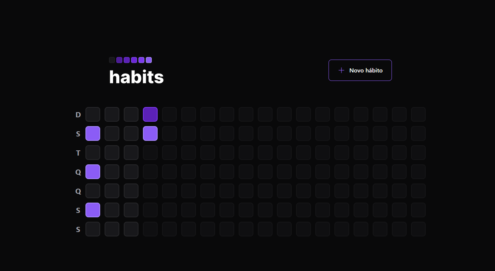
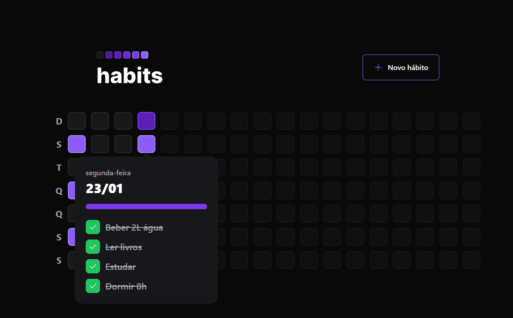

<h1 align="center">Habits - A Habit tracker</h1>

<h3 align="center">Índice</h3>

  <a href="#ℹ-about">About</a>&nbsp;&nbsp;&nbsp;|&nbsp;&nbsp;&nbsp;
  <a href="#-technologies">Technologies</a>&nbsp;&nbsp;&nbsp;|&nbsp;&nbsp;&nbsp;
  <a href="#-layout">Layout</a>&nbsp;&nbsp;&nbsp;|&nbsp;&nbsp;&nbsp;
  <a href="#-see-more">See more</a>

## ℹ About

Habits is an application developed at NLW Setup, event created by Rocketseat.

This app can be used to write and track your day habits and make sure you can complete them every day.

## ⚙ Technologies

This app was made using this technologies:

- React
- TailwindCSS

## 🎨 Layout

You can see this project layout in Figma. [Click here to view](https://www.figma.com/community/file/1195327109778210238).

**Note: You need an account on Figma to access.**

## ➕ See more

- [Habit Tracker Mobile](https://github.com/erick-menezes/habit-tracker-mobile)
- [Habit Tracker Server](https://github.com/erick-menezes/habit-tracker-server)
